# Agentic Compliance Auditor

## Rules-first, AI-assisted policy-control audit workflow

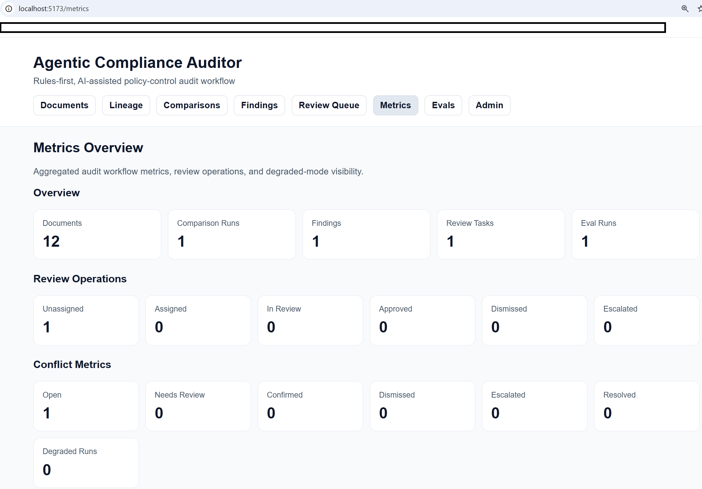

Agentic Compliance Auditor is a version-aware audit system for checking whether internal policies, procedures, control libraries, and external guidance remain aligned over time. It ingests policy material, parses documents into sections, extracts normalized control statements, compares document versions and source pairs, generates typed findings with citations, routes those findings into review tasks, preserves audit lineage, and exposes evaluation and observability outputs through API and UI surfaces.

## Why this system exists

Policy environments do not fail only because content is missing. They also fail because related documents evolve at different speeds. A policy may require one timeline, a control standard may require another, and a procedure may continue referencing an older control version. Those mismatches create operational, governance, and regulatory risk even when every document appears reasonable in isolation.

Agentic Compliance Auditor makes that drift inspectable. It centers deterministic comparison rules as the authoritative layer, uses AI assistance as a secondary aid, and keeps every finding grounded in version history, citations, review actions, and audit events.

## What it demonstrates

- Version-aware ingestion of internal and external policy material
- Section parsing and normalized control statement extraction
- Rules-first contradiction and drift detection
- Typed findings with cited source and target evidence
- Review-task routing with reviewer actions and audit logging
- Evaluation reporting and degraded-mode visibility
- A seeded end-to-end workflow rendered in a React UI

## Architecture overview

Agentic Compliance Auditor is implemented as a modular monolith with a Django backend and a React frontend.

### Backend

The backend is built with Django 5.1.15, Django REST Framework, drf-spectacular, and SimpleJWT. It is organized into domain apps that separate ingestion, lineage, statement extraction, comparison, findings, review operations, audit logging, evaluation, observability, and health concerns.

Core backend apps:

- `core`
- `accounts`
- `documents`
- `lineage`
- `sectioning`
- `statements`
- `comparisons`
- `findings`
- `reviews`
- `audits`
- `evals`
- `observability`
- `health`

The API exposes endpoints for document ingestion, lineage inspection, comparison runs, findings, review tasks, audit events, eval reports, and operational metrics.

### Frontend

The frontend is a React, TypeScript, and Vite application organized by feature area. It renders seeded workflow data for documents, lineage, comparisons, findings, review queue, metrics, eval results, and admin utilities.

### Data and async infrastructure

- PostgreSQL via `pgvector/pgvector:pg16`
- Redis 7 for queue and cache support
- Celery running with `-P solo` on Windows
- Django Channels configured for WebSocket readiness in v1
- `pgvector` enabled only for statement-level similarity support on `ControlStatement.embedding`

### Runtime model

The intended local runtime is:

- backend running locally
- frontend running locally
- PostgreSQL running in Docker Compose
- Redis running in Docker Compose

## Core workflow

1. Create or upload a policy document.
2. Persist the document with checksum-based deduplication.
3. Parse the document into sections.
4. Extract normalized control statements.
5. Launch a comparison run against one or more targets.
6. Apply deterministic contradiction and drift rules.
7. Generate typed findings with citations and memo output.
8. Route reviewable findings into review tasks.
9. Record audit events for traceability.
10. Expose metrics and eval results for inspection.

## Key screens

- `/` — document library
- `/documents/:id` — document metadata, sections, statements, and lineage
- `/lineage` — version and relationship chains
- `/comparisons/new` — comparison builder
- `/findings` — findings dashboard
- `/findings/:id` — finding detail with citations and memo
- `/review-queue` — reviewer work queue
- `/metrics` — system metrics and operational overview
- `/evals` — latest evaluation metrics
- `/admin-tools` — admin and script entry points

## Tech stack

### Backend

- Python 3.13
- Django 5.1.15
- Django REST Framework
- drf-spectacular
- SimpleJWT
- Celery
- Redis
- Channels
- pgvector Python client

### Frontend

- React
- TypeScript
- Vite
- React Router
- TanStack Query
- Axios
- Vitest
- Testing Library

### Infrastructure and tooling

- PostgreSQL with pgvector
- Redis 7
- Docker Compose
- Ruff
- Black
- pytest
- npm
- GitHub Actions

## Repository structure

```text
agentic-compliance-auditor/
├── .github/
│   └── workflows/
├── backend/
│   ├── apps/
│   ├── config/
│   ├── requirements/
│   └── tests/
├── demo_data/
├── docs/
│   ├── adr/
│   ├── architecture/
│   ├── demos/
│   ├── diagrams/
│   ├── domain/
│   └── screenshots/
├── evals/
│   ├── datasets/
│   ├── reports/
│   ├── runs/
│   └── schemas/
├── frontend/
│   ├── package.json
│   ├── vite.config.ts
│   ├── vitest.config.ts
│   ├── tsconfig.json
│   ├── src/
│   └── tests/
├── infra/
│   ├── nginx/
│   └── scripts/
├── .editorconfig
├── .env.example
├── .gitignore
├── .pre-commit-config.yaml
├── docker-compose.yml
├── LICENSE
├── Makefile
├── package.json
├── pyproject.toml
└── README.md
````

## Local setup

### Prerequisites

* Python 3.13
* Node 24
* npm
* Docker Desktop with Docker Compose
* Git

### Clone and prepare

```powershell
cd D:\AI-Projects
git clone <your-repository-url> agentic-compliance-auditor
cd D:\AI-Projects\agentic-compliance-auditor
Copy-Item .env.example .env -Force
```

### Start infrastructure

```powershell
cd D:\AI-Projects\agentic-compliance-auditor
docker compose up -d db redis
docker compose ps
```

### Create the backend virtual environment

```powershell
cd D:\AI-Projects\agentic-compliance-auditor\backend
python -m venv .venv
& .\.venv\Scripts\Activate.ps1
python -m pip install --upgrade pip
pip install -r requirements\dev.txt
```

### Install frontend dependencies

```powershell
cd D:\AI-Projects\agentic-compliance-auditor\frontend
npm install
```

## Environment variables

Core configuration is defined in `.env.example`.

### Database

* `POSTGRES_DB`
* `POSTGRES_USER`
* `POSTGRES_PASSWORD`
* `POSTGRES_HOST`
* `POSTGRES_PORT`
* `POSTGRES_TEST_DB`

### Redis

* `REDIS_HOST`
* `REDIS_PORT`

### Django

* `DJANGO_SECRET_KEY`
* `DJANGO_DEBUG`
* `DJANGO_ALLOWED_HOSTS`
* `DJANGO_SETTINGS_MODULE`

### Frontend and backend ports

* `BACKEND_PORT`
* `FRONTEND_PORT`

### Browser security for local demo

* `CORS_ALLOWED_ORIGINS`
* `CSRF_TRUSTED_ORIGINS`

### JWT

* `JWT_ACCESS_MINUTES`
* `JWT_REFRESH_DAYS`

### AI configuration

* `AI_PROVIDER`
* `AI_MODEL_NAME`
* `OPENAI_API_KEY`

### Workflow defaults

* `DEFAULT_REVIEW_QUEUE`
* `DEFAULT_SLA_HOURS`
* `PGVECTOR_DIMENSIONS`

## Running the stack

### Start PostgreSQL and Redis

```powershell
cd D:\AI-Projects\agentic-compliance-auditor
docker compose up -d db redis
```

### Run database migrations

```powershell
cd D:\AI-Projects\agentic-compliance-auditor\backend
& .\.venv\Scripts\Activate.ps1
python manage.py migrate
```

### Seed demo data and eval artifacts

```powershell
cd D:\AI-Projects\agentic-compliance-auditor\backend
& .\.venv\Scripts\Activate.ps1
python ..\infra\scripts\seed_demo_data.py
python ..\infra\scripts\generate_eval_cases.py
python ..\infra\scripts\run_eval_suite.py
```

### Run the backend server

```powershell
cd D:\AI-Projects\agentic-compliance-auditor\backend
& .\.venv\Scripts\Activate.ps1
python manage.py runserver
```

This is a long-running process. Stop it with `CTRL + C`.

### Run the Celery worker

```powershell
cd D:\AI-Projects\agentic-compliance-auditor\backend
& .\.venv\Scripts\Activate.ps1
celery -A config worker -l info -P solo
```

This is a long-running process. Stop it with `CTRL + C`.

### Run the frontend

```powershell
cd D:\AI-Projects\agentic-compliance-auditor\frontend
npm run dev
```

This is a long-running process. Stop it with `CTRL + C`.

### Stop Docker services

```powershell
cd D:\AI-Projects\agentic-compliance-auditor
docker compose down
```

## Seeded demo scenarios

The repository includes deterministic seeded data so the full workflow can be inspected without manual data preparation.

### Seed summary

* 3 users
* 12 documents
* 12 sections
* 12 statements
* 1 comparison run
* 1 finding
* 2 citations
* 1 memo
* 1 review task
* 13 audit events
* 1 eval run

### Seeded contradiction path

A seeded comparison highlights a timeline mismatch between:

* `Complaints Escalation Policy v3`
* `Complaints Control Standard v5`

The source requires acknowledgment within 10 business days. The target requires 5 business days. That mismatch produces a typed finding with citations, memo output, and a routed review task.

### Additional seeded content

The seeded dataset also includes:

* internal policies
* control-library content
* procedure references
* external guidance examples
* lineage relationships
* observability prompt versions
* evaluation baseline metrics

## API overview

### Health

* `GET /health/live`
* `GET /health/ready`
* `GET /health/deps`

### Documents

* `GET /api/documents/`
* `POST /api/documents/`
* `GET /api/documents/{id}/`
* `PATCH /api/documents/{id}/`
* `GET /api/documents/{id}/sections/`
* `GET /api/documents/{id}/statements/`
* `GET /api/documents/{id}/lineage/`

### Lineage

* `GET /api/lineage/`
* `POST /api/lineage/`
* `GET /api/lineage/version-chains/`

### Comparisons

* `GET /api/comparisons/runs/`
* `POST /api/comparisons/runs/`
* `GET /api/comparisons/runs/{id}/`
* `POST /api/comparisons/runs/{id}/retry/`
* `POST /api/comparisons/runs/{id}/replay/`

### Findings

* `GET /api/findings/`
* `GET /api/findings/{id}/`
* `GET /api/findings/{id}/citations/`
* `GET /api/findings/{id}/memo/`
* `GET /api/findings/{id}/export_packet/`

### Review tasks

* `GET /api/review-tasks/`
* `POST /api/review-tasks/`
* `GET /api/review-tasks/{id}/`
* `POST /api/review-tasks/{id}/assign/`
* `POST /api/review-tasks/{id}/approve/`
* `POST /api/review-tasks/{id}/override/`
* `POST /api/review-tasks/{id}/dismiss/`
* `POST /api/review-tasks/{id}/escalate/`

### Audit events

* `GET /api/audit-events/`
* `GET /api/audit-events/{id}/`

### Evals and metrics

* `GET /api/evals/runs/`
* `POST /api/evals/runs/`
* `GET /api/evals/runs/{id}/`
* `GET /api/evals/reports/latest/`
* `GET /api/metrics/overview/`
* `GET /api/metrics/review-ops/`
* `GET /api/metrics/conflicts/`

### API schema and docs

* `GET /api/schema/`
* `GET /api/docs/`

## Evaluation design and latest metrics

The eval pipeline uses synthetic datasets to test contradiction detection, drift behavior, stale-reference handling, no-conflict cases, adversarial wording, and fallback behavior.

### Dataset groups

* `contradiction_cases`
* `drift_cases`
* `stale_reference_cases`
* `no_conflict_cases`
* `adversarial_cases`
* `fallback_cases`

### Metrics currently exposed

* contradiction precision
* contradiction recall
* stale-reference accuracy
* citation validity rate
* review routing accuracy

### Current seeded baseline

* contradiction precision: `1.00`
* contradiction recall: `1.00`
* stale-reference accuracy: `1.00`
* citation validity rate: `1.00`
* review routing accuracy: `1.00`

The latest machine-readable report is written to:

* `evals/reports/latest.json`

## Failure modes and degraded mode

The workflow is designed to continue operating when AI assistance is unavailable or intentionally disabled.

### Degraded mode behavior

If the contradiction-analysis prompt configuration is inactive, the comparison flow can still:

* run deterministic rules
* create review-required findings
* attach citations
* create review tasks
* record degraded execution status in observability outputs

### Representative failure modes

* provider unavailable
* schema validation failure
* model timeout
* stale or missing prompt configuration
* policy and control drift without model support

### Design principle

AI assistance can improve explanation quality, but deterministic rules remain authoritative for core contradiction detection and review routing.

## Limitations and scope

* This system is a policy-control audit workflow, not a legal advice system.
* It is not a regulatory interpretation engine.
* It does not claim production compliance accuracy.
* The current extraction and contradiction logic is intentionally narrow and deterministic.
* `pgvector` support is limited to statement similarity storage on `ControlStatement.embedding`; it is not the primary audit mechanism.
* The default AI provider is mock-backed, and deterministic rules remain the source of truth.
* The seeded workflow is intended to make system behavior inspectable and reproducible in local development.

## Product gallery

### UI screenshots

#### Dashboard overview


#### Document library

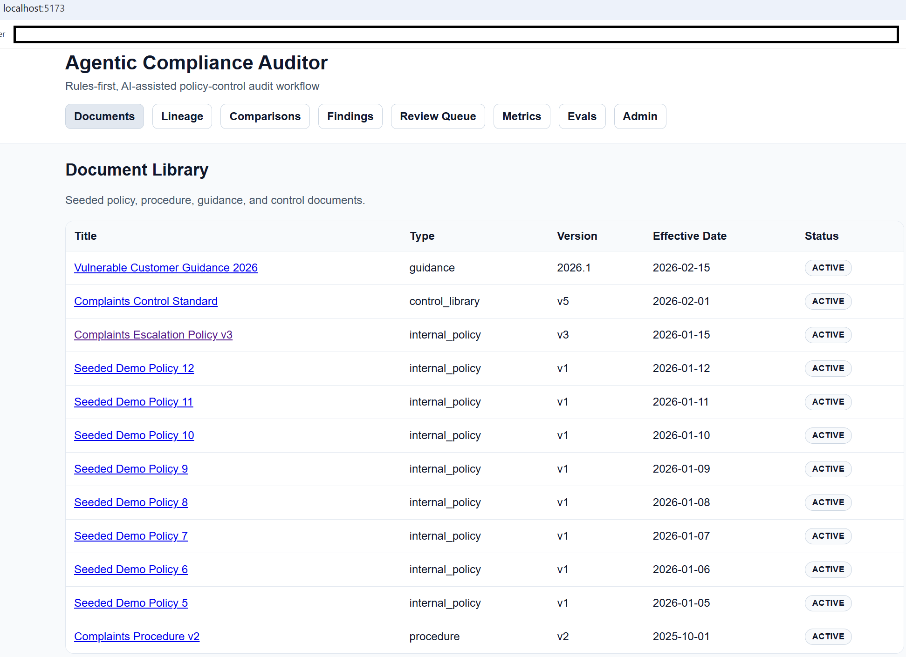

#### Document detail and extracted statements

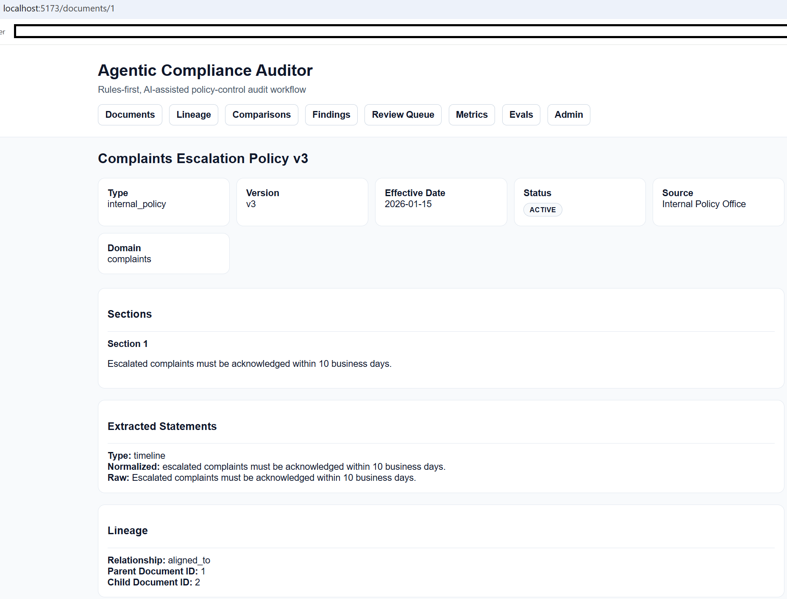

#### Version lineage

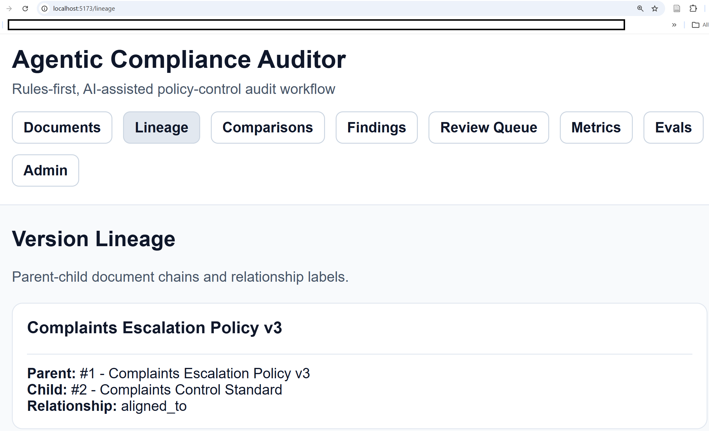

#### Comparison builder

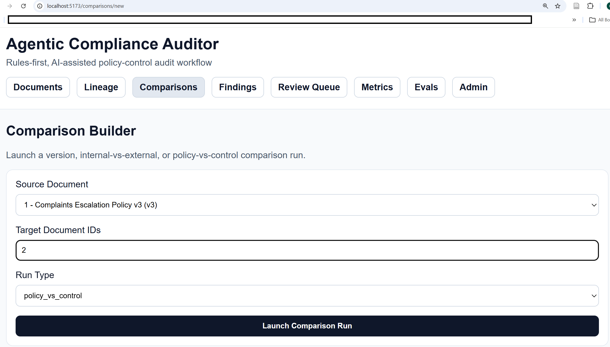

#### Findings dashboard

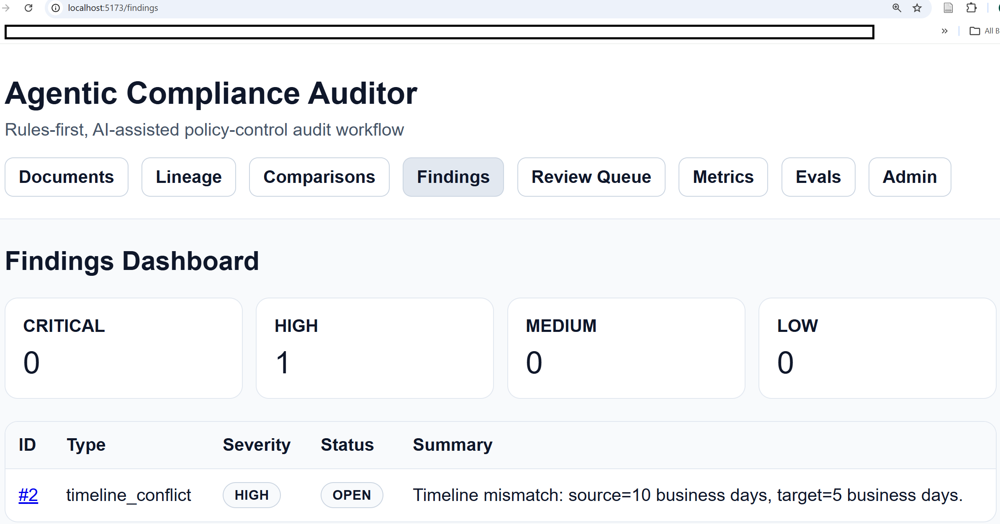

#### Finding detail

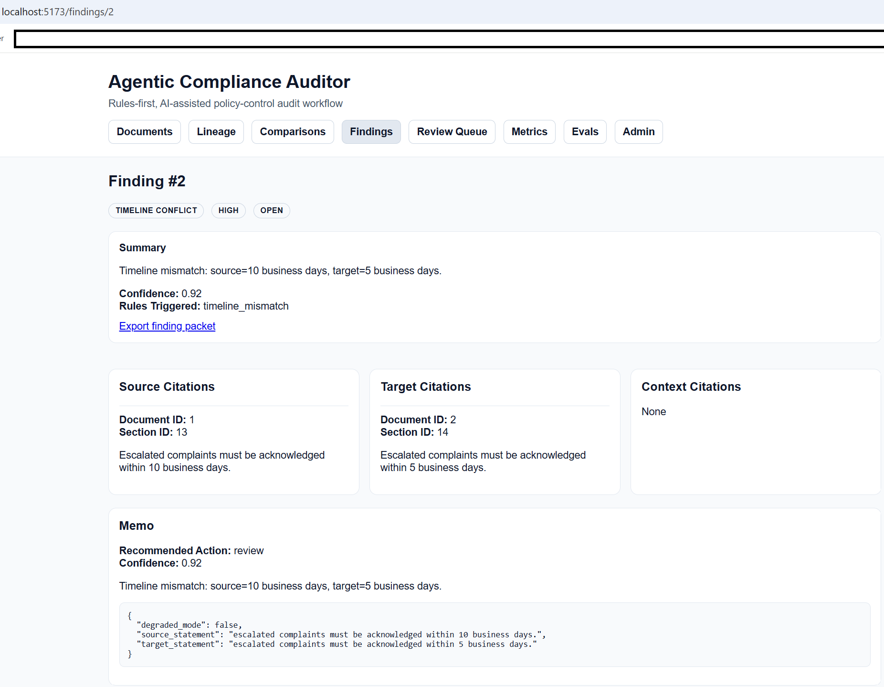

#### Review queue

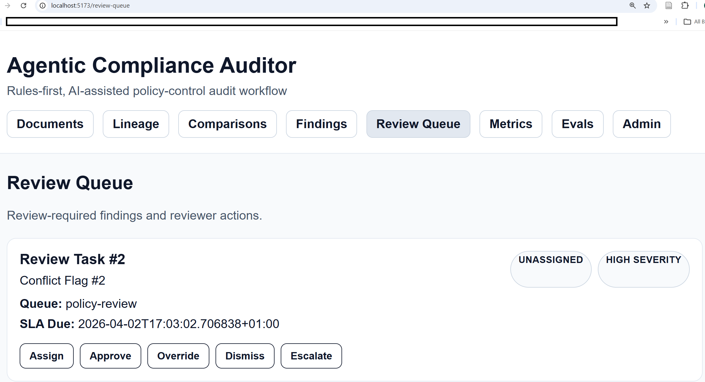

#### Evaluation dashboard

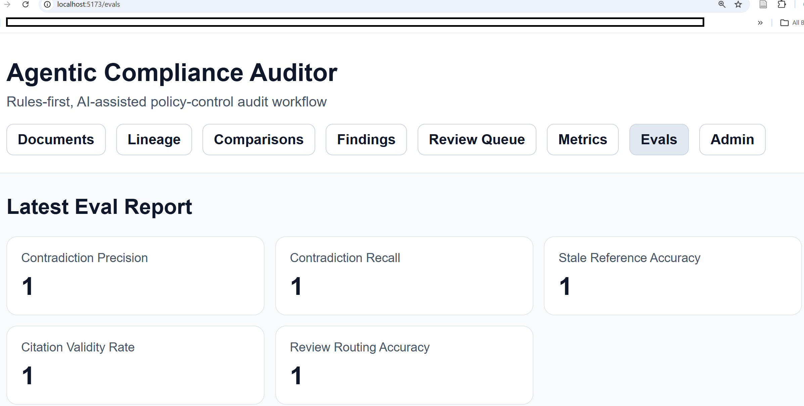

#### Admin prompt versions

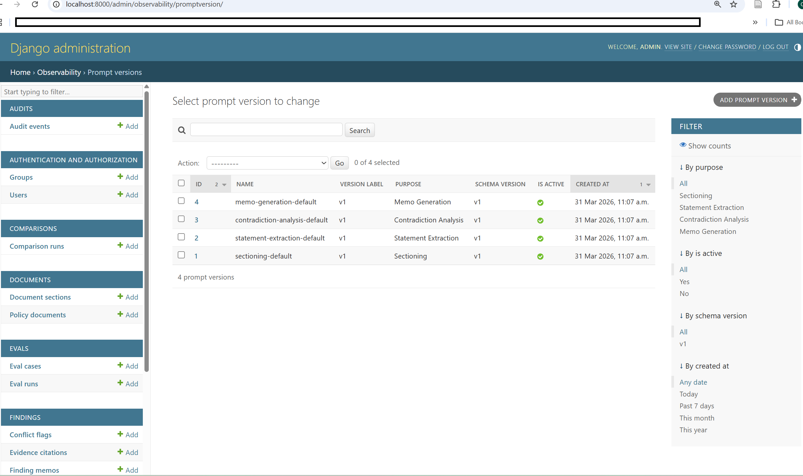

#### Audit timeline

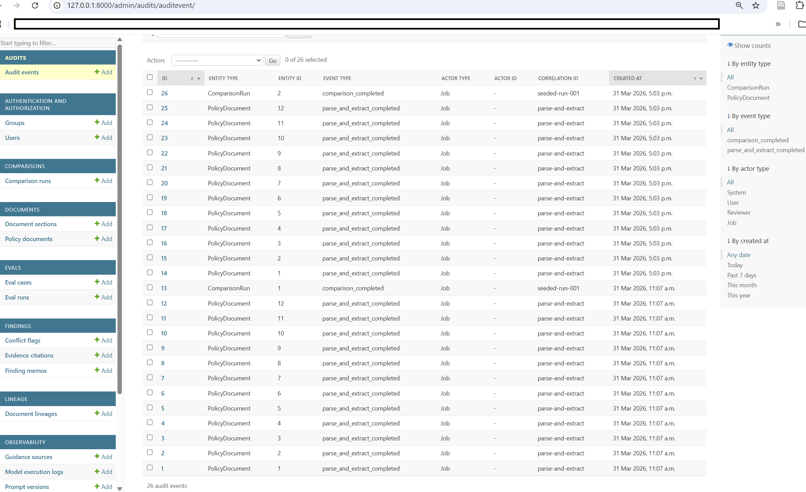

#### Degraded mode evidence


#### Replay comparison run

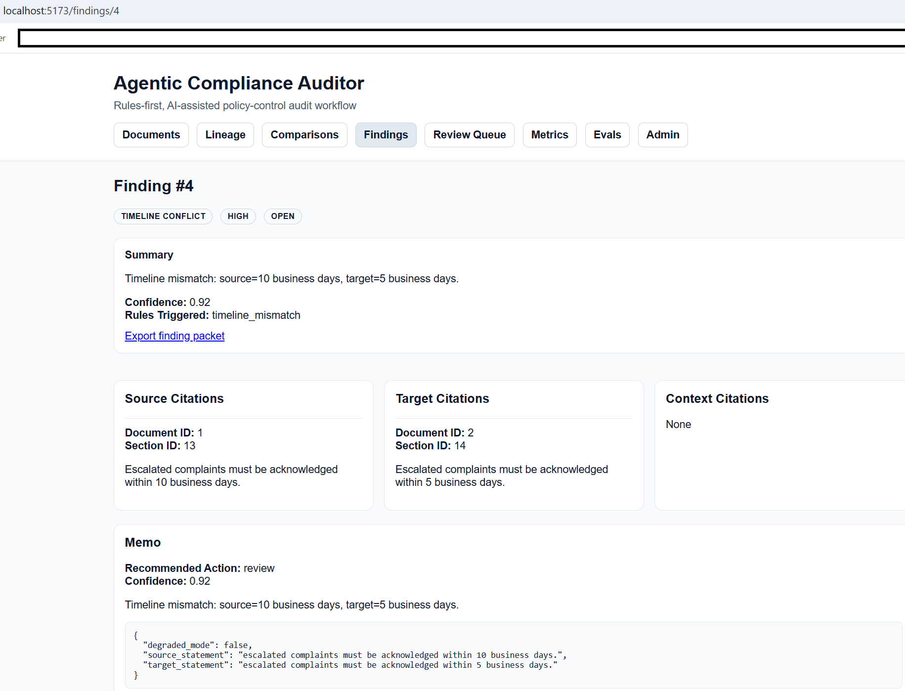

#### Export finding packet

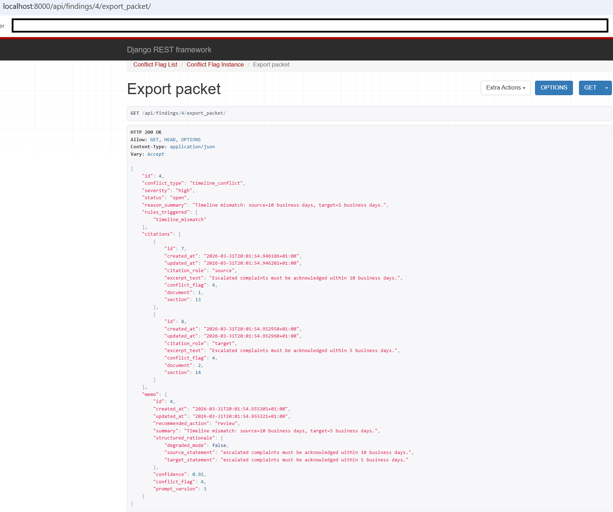

### Diagrams

#### Architecture diagram

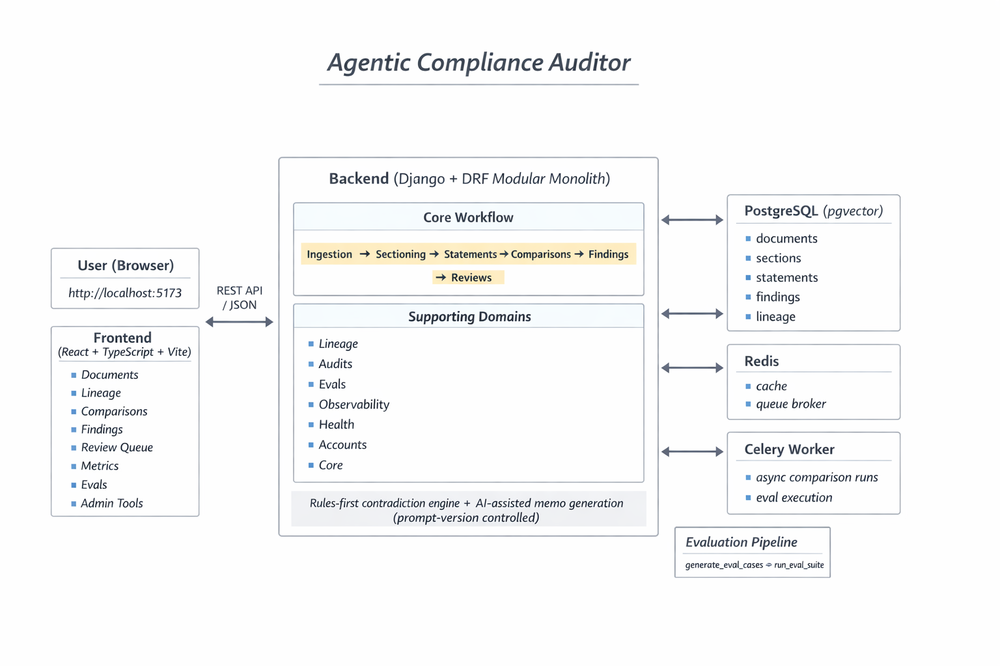

#### Workflow diagram

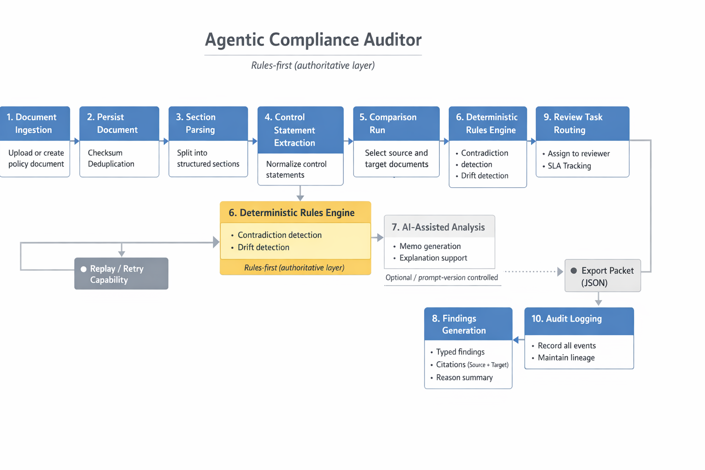

## Documentation map

### Architecture

* `docs/architecture/system-overview.md`
* `docs/architecture/ingestion-pipeline.md`
* `docs/architecture/version-lineage.md`
* `docs/architecture/contradiction-model.md`
* `docs/architecture/review-workflow.md`
* `docs/architecture/evaluation-design.md`
* `docs/architecture/failure-modes.md`

### Architecture decisions

* `docs/adr/0001-modular-monolith.md`
* `docs/adr/0002-postgresql-primary-store.md`
* `docs/adr/0003-structured-control-statements.md`
* `docs/adr/0004-rules-first-ai-assisted.md`
* `docs/adr/0005-version-lineage-first.md`

### Domain references

* `docs/domain/policy-taxonomy.md`
* `docs/domain/contradiction-types.md`
* `docs/domain/severity-model.md`
* `docs/domain/synthetic-data-spec.md`

### Demo references

* `docs/demos/seeded-policy-packs.md`
* `docs/demos/failure-demo.md`

## Testing and CI

### Backend tests

```powershell
cd D:\AI-Projects\agentic-compliance-auditor\backend
& .\.venv\Scripts\Activate.ps1
pytest .\tests\unit
pytest .\tests\integration
pytest .\tests\api
pytest .\tests\workflows
```

### Frontend tests

```powershell
cd D:\AI-Projects\agentic-compliance-auditor\frontend
npx vitest run --config .\vitest.config.ts
```

### Eval regression

```powershell
cd D:\AI-Projects\agentic-compliance-auditor\backend
& .\.venv\Scripts\Activate.ps1
python ..\infra\scripts\generate_eval_cases.py
python ..\infra\scripts\run_eval_suite.py
```

### GitHub Actions

The repository includes separate workflows for:

* backend CI
* frontend CI
* eval regression
* dependency security checks

## License

MIT License. See `LICENSE`.